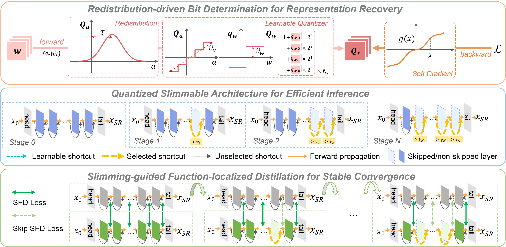

# QuantSR+: Pushing the Limit of Quantized Image Super-Resolution Networks
This project is the official implementation of our paper *QuantSR+: Pushing the Limit of Quantized Image Super-Resolution Networks*.



## Introduction

With the significant advancement of deep learning for image super-resolution (SR), the high storage and computational overhead of SR models severely restricts their deployment in resource-constrained scenarios. Low-bit quantization reduces parameter bit-width for model compression, but SR models operating at ultra-low bit-widths (2–4 bits) may suffer severe accuracy degradation, primarily because of reduced representational capacity and the inherently complex nature of detail-sensitive SR tasks.
To overcome these challenges, we introduce **QuantSR+**, a novel framework that comprehensively enhances quantization operators, network structures, and training optimization strategies, and delivers superior accuracy and efficiency over existing low-bit SR solutions.
First, we introduce *Redistribution-driven Bit Determination* (RBD), a bitwise optimization method that adjusts quantization distribution to enhance accuracy. RBD incorporates redistribution mechanisms for forward and backward propagation of quantized operators, thereby promoting the faithful representation within the quantized SR model.
Second, we introduce *Quantized Slimmable Architecture* (QSA), which starts from a larger model and progressively removes less important blocks. QSA aims to push the accuracy limits of quantized networks, matching (or even exceeding) those of their original full-precision counterparts, while satisfying specific efficiency constraints.
Third, we apply *Slimming-guided Function-localized Distillation* (SFD) that refines the alignment granularity of internal features to supervise the quantized model. SFD constructs a direct loss that reflects the impact of block-level quantization. It further introduces a progressive strategy that optimizes network blocks by their local function, effectively accelerating the convergence.
Extensive experiments show that QuantSR+ delivers state-of-the-art (SOTA) performance compared to quantized SR models and general quantization techniques. For instance, our method achieves an improvement of 0.59 dB in PSNR over 2-bit SOTA baselines on the x4 Set5 dataset.
It also achieves substantial computational efficiency, saving up to 87.9\% of operations and 88.2\% of storage at 2-bit. Furthermore, QuantSR+ significantly enhances both convolution-based and transformer-based architectures, highlighting its broad applicability.

## Dependencies

```bash
# Go to the default directory
pip install -r requirements.txt
python setup.py develop
```

## Execution

```bash
# We provide script to test our 4-bit QuantSR+(Conv) and QuantSR+(Transformer)
python3 basicsr/test.py -opt options/test/test_QuantSR_plus_C_4bit_x4.yml
python3 basicsr/test.py -opt options/test/test_QuantSR_plus_T_4bit_x4.yml
```
